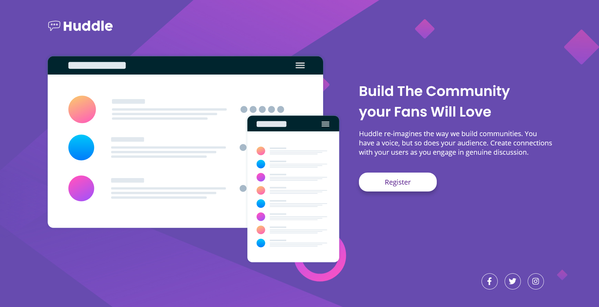

# Huddle Landing Page

## Table of contents

- [Overview](#overview)
  - [The challenge](#the-challenge)
  - [Screenshots](#screenshots)
  - [Links](#links)
- [My process](#my-process)
  - [Built with](#built-with)
  - [What I learned](#what-i-learned)
- [Author](#author)
- [Acknowledgments](#acknowledgments)

## Overview

### The challenge

A landing page design has been given. We have to implement it in such a way so that users should be able to:

- View the optimal layout for the page depending on their device's screen size
- See hover states for all interactive elements on the page

### Screenshots

Desktop Version

 

Mobile Version

### Links

- Solution URL: [GitHub Repository](https://github.com/soumalyapakrashi/huddle-landing-page)
- Live Site URL: [GitHub Pages](https://soumalyapakrashi.github.io/huddle-landing-page)

## My process

### Built with

- CSS custom properties
- Flexbox
- CSS Grid
- Mobile-first workflow
- React

### What I learned

From this project, I learned a lot about SVGs and how to position them as background images. It was really tricky but I made it at last! I also learned about how to set CSS styles from within a JavaScript file in a React project and how to use media queries from the JavaScript file using a package called [react-responsive](https://www.npmjs.com/package/react-responsive).

## Author

- Twitter - [@iamspakrashi](https://twitter.com/iamspakrashi)
- GitHub - [Soumalya Pakrashi](https://github.com/soumalyapakrashi)

## Acknowledgments

The idea and designs of this project has been taken from Frontend Mentor website named [Huddle Landing Page with Single Introductory Section](https://www.frontendmentor.io/challenges/huddle-landing-page-with-a-single-introductory-section-B_2Wvxgi0).
